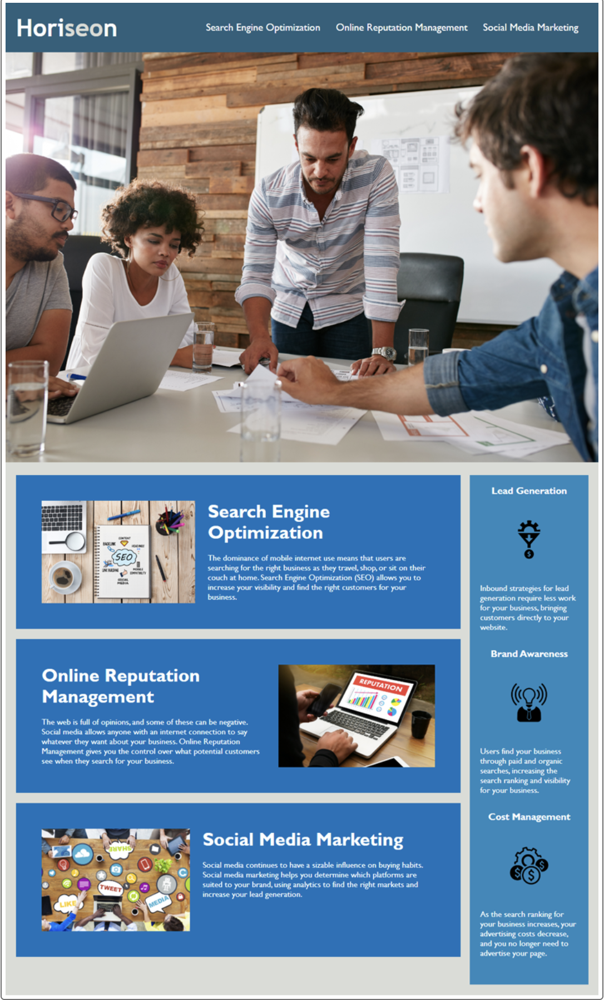

# horiseon-social-solutions

# Challenge Description: Refactoring 

This weeks challenge was to refactor code for the Horiseon webpage to make it more accessible. In doing so this makes it easier for other software developers to read and increases efficiency. 

## Changes & Updates to the Code: 

* Added semantic HTML elements and replaced divs
* Consolidated classes to reduce redundancy 
* Replaced "webpage" with a more descriptive title
* Consolidated repetative CSS styles
* Updated CSS to fix divergence between the style sheet and HTML
* Corrected missing id in the navigation menu so that links worked better
* Added comments in HTML and CSS to make it easier to read and more concise

# Site Image 

# Resources & Collaborators

UTA Boot Camp Instructors, TA's, AskBCS Learning Assistants, tutors, and class peers.

* https://www.w3schools.com/html/html5_semantic_elements.asp

* https://www.w3schools.com/css/css_syntax.asp

* https://www.youtube.com/watch?v=eDmY17-GuLo&t=605s

* https://www.youtube.com/watch?v=kGW8Al_cga4&t=115s

* https://stackoverflow.com/questions/74479435/correct-usage-of-html-semantic-elements

# Site Link
http://127.0.0.1:5500/index.html
